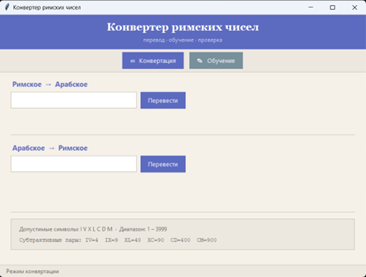
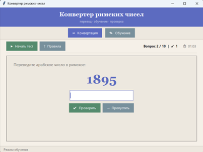
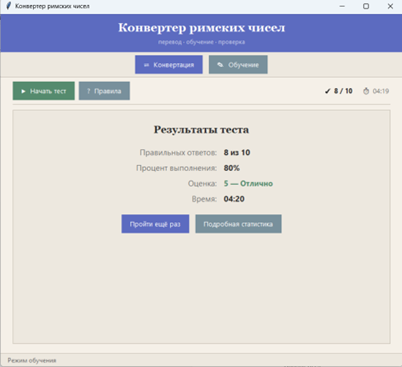

# Roman Numeral Converter & Learning Tool

Desktop application for bidirectional conversion between Roman and Arabic numerals with an integrated interactive learning mode. Built with Python and Tkinter.

## Features

- Two-way conversion: Roman -> Arabic and Arabic -> Roman (1-3999)
- Smart validation with clear error messages and correction hints
- Interactive learning mode with 10-question quizzes
- Detailed feedback on mistakes with rule explanations and step-by-step breakdowns
- Progress tracking: timer, score, percentage, and grade (1-5)
- Built-in rules reference

## Screenshots

| Converter | Learning | Results |
|:---:|:---:|:---:|
|  |  |  |

## Installation

git clone https://github.com/arinakholkina07/roman-converter.git
cd roman-converter
python main.py

No external dependencies required. Python 3.10+ with Tkinter only.

## Project Structure

- `main.py` - Entry point
- `gui.py` - Tkinter GUI
- `converter.py` - Conversion algorithms
- `learning.py` - Learning session logic
- `validation.py` - Input validation
- `requirements.txt` - No external dependencies
- `setup.py` - Package configuration
- `screenshots/` - Application screenshots
- `LICENSE` - MIT License
- `Отчет_по_курсовой_работе_ХолкинаАВ_БИВ252.pdf`
- `Руководство пользователя Холкина Арина БИВ252.pdf`
- `Техническое задание на курсовую работу Холкина Арина БИВ252.docx`

## How It Works

### Conversion Algorithms

Roman -> Arabic (scan right to left):

MCMXCIX = 1999
M(1000) - C(100) + M(1000) - X(10) + C(100) - I(1) + X(10)
= 1000 + 900 + 90 + 9 = 1999

Arabic -> Roman (greedy algorithm):

1999 -> 1000(M) + 900(CM) + 90(XC) + 9(IX) = MCMXCIX

### Learning Mode

1. Click "Обучение" -> "Начать тест"
2. Answer 10 random questions (mixed types)
3. Get instant feedback with rule explanations
4. View results: score, percentage, grade, and time

### Grading Scale

| Score | Grade |
|:---:|:---:|
| 80-100% | 5 (Excellent) |
| 60-79% | 4 (Good) |
| 40-59% | 3 (Satisfactory) |
| < 40% | 2 (Unsatisfactory) |

## User Guide

Converter Mode:
- Enter a Roman numeral -> get Arabic result
- Enter an Arabic number (1-3999) -> get Roman result
- Invalid entries show descriptive error messages

Learning Mode:
- "Проверить" or Enter -> submit answer
- "Пропустить" -> skip question (counted as wrong)
- "Правила" -> open reference window
- "Пройти ещё раз" -> restart with new questions
- "Подробная статистика" -> view all answers

## Validation & Error Handling

The program handles all edge cases:
- Invalid Roman characters
- Non-canonical notation (IIII, VX, IC, IL, IM)
- Numbers outside 1-3999 range
- Leading zeros
- Empty input

All errors provide clear, actionable messages.

## Documentation

- Coursework Report: Отчет_по_курсовой_работе_ХолкинаАВ_БИВ252.pdf
- User Manual: Руководство пользователя Холкина Арина БИВ252.pdf
- Technical Specification: Техническое задание на курсовую работу Холкина Арина БИВ252.docx

## Tech Stack

- Python 3.10+
- Tkinter (built-in GUI)
- No external dependencies

## License

MIT License - see LICENSE file for details.

## Author

Arina Kholkina
Student, HSE University - MIEM
Group: BIV252
GitHub: https://github.com/arinakholkina07

---

Coursework project for "Algorithmization and Programming" discipline.